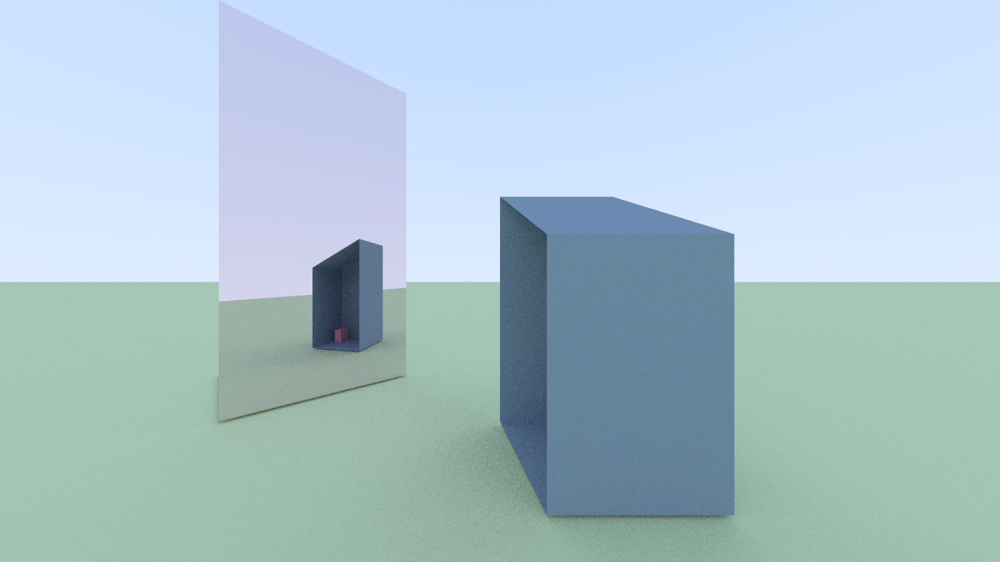

# Raytracing in Rust

My implementation of a ray tracer in rust. 

Geometry Support: Triangles

Material Support: Lambertians, Metals

To run use `cargo run --release`

Scene definition in main.rs

# TODO
  - [ ] Read scene from text file 
  - [ ] Multithreaded rendering
  - [ ] Moveable Camera

# Examples

This is an old example, from when spheres were the only primitive
